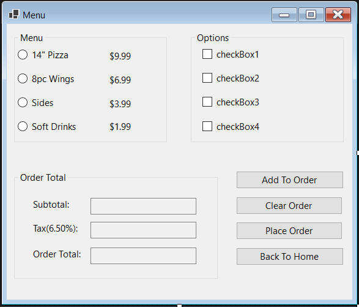

# Pizza Shop App
Welcome to our Pizza Shop App. This app was build using Visual Studio and using Entity Framework to manage the database.
In the app you can create a new account, login, view customer info, and place an order. 
 
# Features
- Login Page
- Create Account Page
- Customer Account Page
- Ordering system
 
# Prerequisites 
- [Visual Studio 2022](https://visualstudio.microsoft.com/free-developer-offers/)
- [.NET 6 SDK](https://dotnet.microsoft.com/en-us/download/dotnet/6.0)
 
# Log In Page

 
# New Customer Page

 
# Customer Account Page

 
# Ordering Page

 
# Home Page

